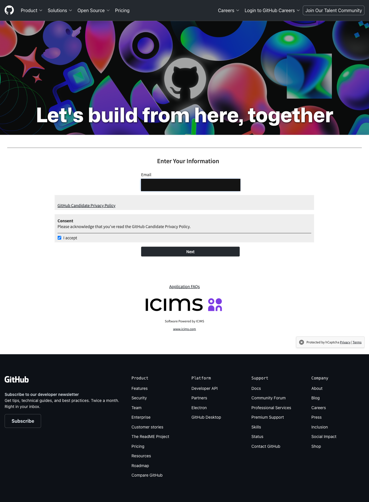

# AIApply

Finds job postings that fit your parameters and auto-applies to a whitelist of
company ATS boards (Greenhouse/Lever, plus a hardcoded GitHub careers
integration) via Playwright, with an Azure AI Foundry-hosted model doing
resume parsing, fit scoring, and free-text answers. Postings found outside
the whitelist are only ever surfaced for you to review — never auto-applied
to.

## Setup

1. `uv sync` (installs deps), then `uv run playwright install chromium`.
2. Provision Azure AI Foundry: `./scripts/setup_azure.sh` (edit the vars at
   the top first, or override via env vars), then copy `.env.example` to
   `.env` and fill in the printed endpoint/key.
3. Drop your resume at `data/resume.pdf` (or `.docx`).
4. Edit `config/profile.yaml` (target roles, locations, salary floor,
   `screening_answers` for factual screening questions) and
   `config/sites.yaml` (the whitelist of companies to auto-apply to, by
   Greenhouse/Lever slug). The Greenhouse/Lever entries ship with a
   placeholder `example-company` slug — replace both before running for
   real. A run with a placeholder slug still in place will error out before
   even reaching discovery, since a 404 on a fake slug isn't caught.

## Running

```
uv run python -m aiapply.run --dry-run --headed
```

Always do this first against your real whitelist: fills out real
applications but never clicks submit, and runs with a visible browser so you
can watch it work. Once you've reviewed a few filled forms and are
comfortable, drop the flags for a real, headless, submitting run:

```
uv run python -m aiapply.run
```

Each run writes a summary to `data/summaries/<date>.md` (applied / surfaced
/ errors) and a full audit log (fields + AI-generated answers per
application) to `data/store.db`.

## Known limitations

- Greenhouse, Lever, and GitHub's careers site all protect their application
  forms with CAPTCHA (reCAPTCHA / hCaptcha). This project never attempts to
  solve or bypass those — if one blocks a submission, that application is
  skipped and flagged in the summary rather than retried.
- Only Greenhouse and Lever have full, general apply flows. GitHub is a
  single hardcoded company integration (not a generic ATS vendor
  integration), and its apply flow currently always ends in a CAPTCHA block
  or a manual-review flag rather than a real submission — see
  `apply/github_apply.py` and the note in `CLAUDE.md`. Other ATSs (Workday,
  generic iCIMS tenants, etc.) aren't supported at all. Below is a
  `--dry-run` screenshot of how far it gets on a good run — the iCIMS
  email/consent step (email redacted); a CAPTCHA challenge blocks it more
  often than not:

  
- Broader "surface only" discovery beyond the whitelist
  (`config/sites.yaml`'s `discovery.web_search`) isn't wired to a search
  provider yet -- ask Claude Code to do that step live with its own web
  search when you run the daily check.
